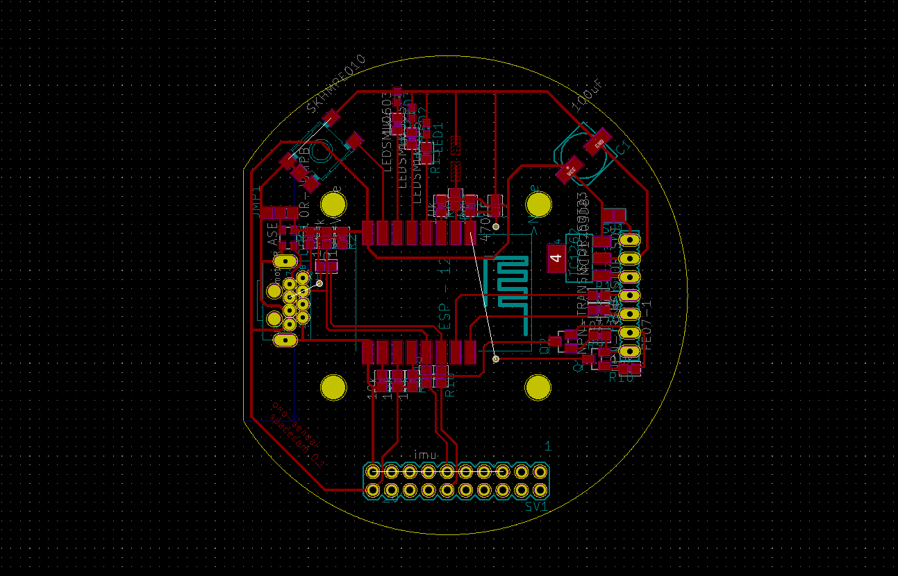

# SpaceCam Hardware

This repository contains both Eagle and KiCad project files for the spaceCam IR tracker hardware and 3D printable model files for the enclosure.

### Main components
* ESP-12 module
* Pixart sensor *( e.g. from a Nintendo Wiimote )*
* BNO-055 XPlained Pro *( optional IMU cartridge )*
